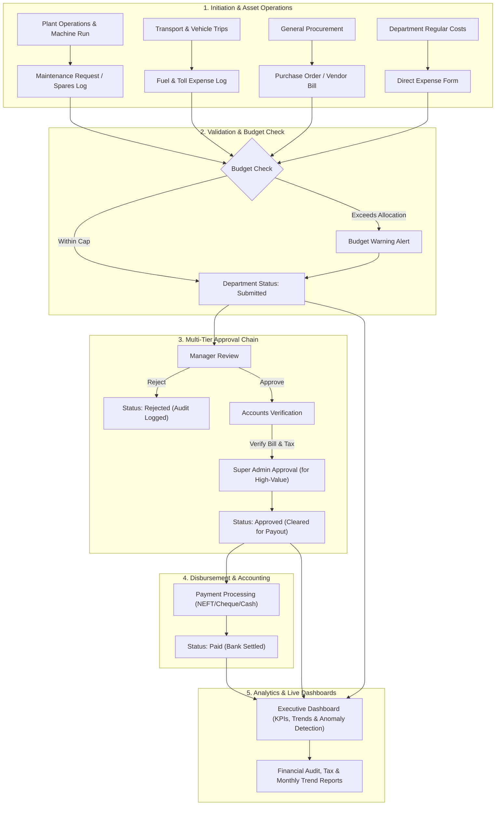
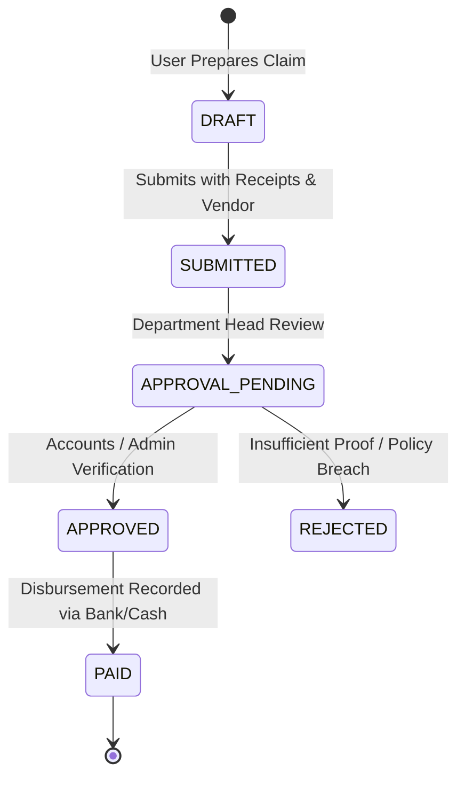

# Manufacturing Expense & Cost Control ERP: Architecture, Workflows & Operational Guide

This document provides a comprehensive operational blueprint and technical workflow guide for the **Manufacturing Expense & Cost Control ERP (MECS)**. It illustrates the complete end-to-end flow from departmental expense generation to executive reporting, accompanied by detailed step-by-step module workings and governance matrices.

---

## 1. Executive Architecture & End-to-End ERP Flow

The ERP operates on a central data and governance backbone built with Next.js App Router, Prisma ORM, PostgreSQL, and strict Role-Based Access Control (RBAC).

---

## 2. Authentication & Role-Based Access Control (RBAC)

### How Authentication & Security Work
1. **Cryptographic JWT Sessions**:
   - Secure HS256-signed JSON Web Tokens stored in HTTP-only, SameSite=Lax cookies (`mecs_session`).
   - Passwords salted and hashed with bcrypt (10 rounds).
2. **7 Granular Enterprise Roles**:
   - `SUPER_ADMIN`: Complete company-wide visibility, system configurations, user & role assignments, high-value overrides.
   - `ADMIN`: Organizational configurations, user management, and department workflows.
   - `ACCOUNTS`: Financial approval gatekeeper, vendor payment recording, ledger matching.
   - `PURCHASE_MANAGER`: PO issuance, vendor contract pricing, goods receipt verification.
   - `MAINTENANCE_MANAGER`: Plant machine health, spare parts inventory tracking, repair labour accounting.
   - `TRANSPORT_MANAGER`: Logistics fleet trips, driver allocation, fuel tracking and vehicle compliance.
   - `EMPLOYEE`: Field & office expense submissions, bill uploads, personal approval tracking.
3. **Route & Server Action Guards**:
   - Every page and server action is protected by `guardModule(moduleKey)` and database permission catalogs, rejecting unauthorized access with strict 403 responses.

---

## 3. Executive Dashboard & Real-Time Spend Analytics

### Workings & Operational Highlights
1. **Real-Time KPI Cards**:
   - **Total Expenses**: Aggregated approved and settled spend across all company cost centers (e.g. ₹30,54,206).
   - **This Month Spend**: Month-to-date tracking featuring explicit percentage comparison (`↓ 20.1% vs Aug 2026`).
   - **Pending Approvals**: High-priority count of items awaiting review.
   - **Budget Utilization**: Percentage of allocated funds consumed across departments.
2. **Interactive 30-Day & 12-Month Expense Trend**:
   - Continuous vector line graph with spot hover tooltips displaying the exact date and amount spent on any day.
   - Dual-mode switcher between continuous daily breakdown and 12-month rolling trends.
3. **Automated Anomaly Detection Engine**:
   - Compares current month category and department spending against a rolling 3-month trailing baseline.
   - Flags sudden cost surges (e.g. `Machinery +389%`, `Printing +379%`) to alert management to uncharacteristic spikes.
4. **Clean Sidebar Navigation & Ergonomic User Card**:
   - Structured sections: **Finance**, **Operations**, **Procurement**, **Insights**, and **Administration**.
   - Bottom user profile is housed in a clean, full-bleed charcoal rectangle with clear white typography, blue role label, and an immediate red door logout icon.

---

## 4. Expense Management & Approval Lifecycle

### The Expense Lifecycle

### Workings
1. **Submission**:
   - Multi-category cost attribution: select project/department, expense category (e.g. Spare Parts, Fuel, Printing), GST/TDS tax breakup, and bill attachments.
2. **Approval Hierarchy**:
   - Department Managers review operational validity.
   - Accounts verifies tax compliances and vendor invoice legitimacy.
   - Threshold escalation: high-value transactions route to Super Admin approval.
3. **Settlement & Payment Tracking**:
   - Real-time logging of payment modes (NEFT/RTGS, Cheque, Cash, UPI), transaction references, and partial payout ledgers.
- **Document Attachment Storage**: Direct integration for receipts and vendor bills with cloud storage and preview modals.

---

## 5. Vehicle Operations & Fuel Efficiency Tracking

### Workings & Anomaly Calculations
1. **Trip & Fuel Logging**:
   - Records Vehicle Registration (`TN-01-AB-1234`), Driver Name, Fuel Volume (Litres), Cost, and Odometer Distance (km).
2. **Automated Efficiency Metric (km/L)**:
   - System calculates:
     $$\text{Efficiency} = \frac{\text{Distance Covered (km)}}{\text{Fuel Dispensed (Litres)}}$$
3. **Fuel Thefts & Efficiency Outlier Alerts**:
   - Compares each fuel fill against the vehicle's historical average.
   - An efficiency drop below the threshold (e.g. `5.06 km/L` vs `11.72 km/L` standard) triggers an immediate **`⚠️ Anomaly`** badge, highlighting potential fuel pilferage, engine faults, or odometer tampering.
4. **Statutory Document Expiry Guards**:
   - Proactively monitors vehicle **Pollution certificate expiry**, **Fitness certificate expiry**, and insurance dates, alerting transport managers 30 days prior to lapse.

---

## 6. Plant Machinery, Spares & Preventative Maintenance

### Workings
1. **Machine Asset Register**:
   - Master ledger of plant machinery (Extruders, Injection Moulding, Printing Presses, Compressors) tracking serial numbers, operational status (`Running`, `Under Maintenance`, `Idle`), and installation dates.
2. **Preventative Maintenance Schedules**:
   - Recurring maintenance schedules (weekly lubrication, monthly calibration, quarterly overhaul) to prevent costly downtime.
3. **Labour & Spare Parts Cost Allocation**:
   - Work orders log both external technician labour fees and spare parts consumed (e.g., SKF Bearings, V-Belts, Heating Elements), linking all maintenance costs directly into plant operating expenses.

---

## 7. Procurement, Purchase Orders & Vendor Management

### Workings
1. **Purchase Orders (PO)**:
   - Creation of formal POs with line items, tax components (CGST/SGST/IGST), unit costs, and delivery due dates.
2. **Goods Receipt Note (GRN) Verification**:
   - Warehouse confirms physical receipt of goods against PO items before invoice clearance.
3. **Three-Way Matching**:
   - Matches Purchase Order, Goods Receipt, and Vendor Tax Invoice before payments are processed by the Accounts department.

---

## 8. Budgets & Financial Cost Allocation

### Workings
1. **Fiscal Year Planning**:
   - Department-level budget ceilings assigned across fiscal quarters (Production, Maintenance, Transportation, Warehouse, Admin).
2. **Real-Time Burn Rate**:
   - Live reconciliation of approved + committed spend against allocated funds.
3. **Overspend Protection**:
   - Soft warnings and approval escalation gates prevent unallocated operational expenditures.

---

## 9. Users, Roles & Governance Matrix

| Role | Expenses | Vehicles & Fuel | Machinery | Purchases | Budgets | Settings |
| :--- | :--- | :--- | :--- | :--- | :--- | :--- |
| **Super Admin** | Full (Approve/Pay) | Full Access | Full Access | Full Access | Full Access | Full Control |
| **Admin** | Full (Approve) | Full Access | Full Access | Full Access | View / Allocate | User & Depts |
| **Accounts** | Verify & Pay | View / Audit | Spares Audit | Three-Way Match | Monitor | Financial Config |
| **Purchase Manager** | Department Submit | View | Parts PO | Full PO & Vendor | PO Budgets | Vendor Master |
| **Maintenance Manager** | Department Submit | View | Full Work Orders | Parts Requisition | Dept Budget | Machine Master |
| **Transport Manager** | Department Submit | Full Transport Ops | View | Transport PO | Dept Budget | Vehicle Master |
| **Employee** | Personal Submit | Personal Log | View | - | - | Profile Only |
